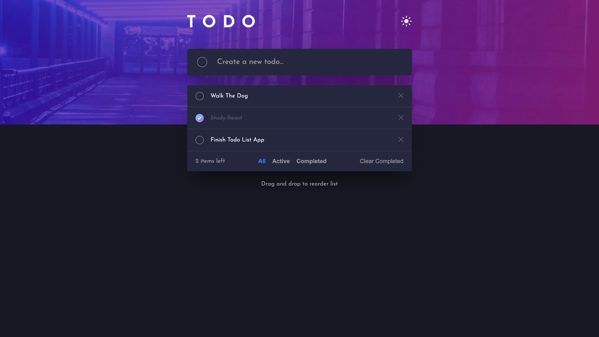

# Frontend Mentor - Todo app solution

This is a solution to the [Todo app challenge on Frontend Mentor](https://www.frontendmentor.io/challenges/todo-app-Su1_KokOW). Frontend Mentor challenges help you improve your coding skills by building realistic projects.

## Table of contents

- [Overview](#overview)
  - [The challenge](#the-challenge)
  - [Screenshot](#screenshot)
  - [Links](#links)
- [My process](#my-process)
  - [Built with](#built-with)
  - [What I learned](#what-i-learned)
  - [Continued development](#continued-development)
  - [Useful resources](#useful-resources)
- [Getting Started](#getting-started)
- [Author](#author)

## Overview

### The challenge

Users should be able to:

- View the optimal layout for the app depending on their device's screen size
- See hover states for all interactive elements on the page
- Add new todos to the list
- Mark todos as complete
- Delete todos from the list
- Filter by all/active/complete todos
- Clear all completed todos
- Toggle light and dark mode
- **Bonus**: Drag and drop to reorder items on the list

### Screenshot



### Links

- Solution URL: [https://github.com/edwardshanahan97/frontend-mentor-todo-app](https://github.com/edwardshanahan97/frontend-mentor-todo-app)
- Live Site URL: [https://edwardshanahan97.github.io/frontend-mentor-todo-app/](https://edwardshanahan97.github.io/frontend-mentor-todo-app/)

## My process

### Built with

- Semantic HTML5 markup
- CSS custom properties
- Flexbox
- Responsive design
- Mobile-first workflow
- JavaScript
- React
- React Hooks
- Vite

### What I learned

One of the main things I learned while building this project was how to manage and filter data in React based on user interaction.

I used a filter state to determine which todos should be displayed. Depending on whether the user selects All, Active, or Completed, I use JavaScript's filter() method to create the appropriate list.

```js
if (filter === "completed") {
  filteredTodos = todoList.filter((todo) => todo.completed === true);
} else if (filter === "active") {
  filteredTodos = todoList.filter((todo) => todo.completed === false);
} else {
  filteredTodos = todoList;
}
```

### Continued development

I would like to add drag-and-drop functionality so users can reorder their todos and improve my understanding of updating item order in React state.

### Useful resources

- [Remove Google Auto Fill Background](https://docs.github.com/en/rest/users/users) - Useful for understanding how to remove Google auto fill on inputs when form is submitted

## Getting Started

### Installation

If you'd like to run this project locally:

1. Clone the repository:

```bash
git clone https://github.com/edwardshanahan97/frontend-mentor-todo-app.git
```

2. Navigate into the project:

```bash
cd frontend-mentor-todo-app
```

3. Install the dependencies:

```bash
npm install
```

4. Start the development server:

```bash
npm run dev
```

## Author

- Frontend Mentor - [@edwardshanahan97](https://www.frontendmentor.io/profile/edwardshanahan97)
- Github - [@edwardshanahan97](https://github.com/edwardshanahan97)
